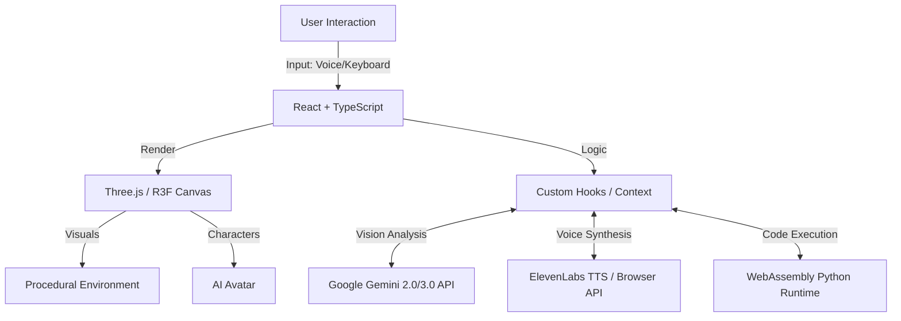

# 🌌 Futuristic Learning Hub: Neural Command

**Neural Command** is a next-generation 3D simulation designed to revolutionize how we learn to code. By combining an immersive Cyberpunk environment with an advanced AI Learning Companion (**Luna**), this project bridges the gap between abstract programming concepts and interactive, spatial computing.

 

---

## 🏗️ System Architecture

Neural Command operates on a hybrid architecture combining a high-performance 3D frontend with serverless AI integration.



### Data Flow
1.  **Input**: The user interacts via Voice (Microphone), Text (Terminal), or Movement (WASD).
2.  **Processing**: 
    *   **Voice**: Converted to text, sent to **Gemini API** for context-aware response.
    *   **Code**: Executed locally in the browser via **Pyodide**. Errors are caught and sent to Luna for analysis.
    *   **Vision**: Webcam frames are analyzed by **Gemini Vision** (Mentor Mode) to provide real-time study habits feedback.
3.  **Visualization**: The state updates drive the **React Three Fiber** scene, triggering animations, movement, and UI updates.

---

## 🚀 Core Features

### 🧠 Intelligent AI Companion: Luna
Luna is not just a chatbot; she is an autonomous entity living in the simulation.
*   **Role**: AI Learning Assistant & Mentor.
*   **Brain**: Powered by **Gemini 2.0/3.0**, capable of deep context understanding and code analysis.
*   **Voice**: Integrated **ElevenLabs** TTS for natural, emotive speech.
*   **Behavior**:
    *   **Autonomous Wandering**: She walks freely, follows you, and explores the hub.
    *   **Leash System**: Intelligently stays within a 4-meter radius of the user.
    *   **Activity Aware**: Reacts to your coding errors and environment.

### 👁️ Mentor Mode (Computer Vision)
Activating **Mentor Mode** gives Luna access to your webcam to ensure you stay focused.
*   **Real-time Analysis**: Analyzes video frames every 30 seconds.
*   **Low-Light Enhancement**: Automatically adjusts brightness/contrast for better detection.
*   **Behavioral Feedback**: Detects phone usage, slouching, or lack of focus and verbally corrects you ("Put the phone away," "Sit up straight").

### 🔮 HoloProjector
A volumetric display system to visualize abstract data.
*   **3D Rendering**: Projects floating 3D primitive shapes (Torus, Sphere, Knot, etc.) above the desk.
*   **Interactive**: Shapes rotate and pulse based on simulation state.
*   **Future Ready**: Designed to visualize data structures (arrays, trees) in 3D space.

### 🐍 Immersive Python Coding
*   **In-Browser Kernel**: Run Python code directly in the browser using **Pyodide**.
*   **Real-Time Assistance**:
    *   **Error Analysis**: If your code crashes, Luna analyzes the traceback.
    *   **Voice Guidance**: She verbally explains *why* it failed and suggests a fix.

### 🌐 High-Fidelity 3D Environment
*   **Tech Stack**: Built with **React Three Fiber (R3F)** and **Three.js**.
*   **Visuals**:
    *   **Procedural Tiling**: Custom shader-like canvas textures for floor tiles.
    *   **Performance Scaling**: Dynamic quality settings (Low/Medium/High) affecting shadows, antialiasing, and lighting counts.
    *   **Post-Processing**: Bloom and lighting effects for that "Cyberpunk" aesthetic.

---

## 📂 Project Structure

```text
src/
├── components/         # 3D and UI Components
│   ├── CyberRoom.tsx   # Main environment (Floor, Walls, Lights)
│   ├── HoloProjector.tsx # 3D Holographic Display logic
│   ├── Experience.tsx  # Main R3F Scene composition
│   ├── PythonEditor.tsx # 2D HTML Overlay for coding
│   └── ...
├── hooks/              # Custom Logic
│   ├── useSimulation.tsx # Global state (Logs, Characters)
│   └── usePerformanceSettings.tsx # Graphics quality management
├── services/           # External API Integrations
│   ├── mentor.ts       # Gemini Vision & Logic handling
│   └── elevenlabs.ts   # TTS Service
├── App.tsx             # Main Entry & Canvas Setup
└── main.tsx            # React Root
```

---

## 🛠️ Technology Stack

| Component | Technology | Description |
| :--- | :--- | :--- |
| **Frontend Framework** | React 19 + TypeScript | Core UI and Logic |
| **3D Engine** | Three.js / @react-three/fiber | DOM abstraction for Three.js |
| **Helpers** | @react-three/drei | Useful R3F helpers (Text, Grid, Float) |
| **Post-Processing** | @react-three/postprocessing | Bloom, Depth of Field effects |
| **Build Tool** | Vite | Fast development server and bundler |
| **Styling** | Tailwind CSS v4 | Utility-first CSS for UI overlays |
| **Language Runtime** | Pyodide (WebAssembly) | Python 3.10 running in browser |
| **AI Logic** | Google Gemini API | Multimodal AI (Text, Vision) |
| **Text-to-Speech** | ElevenLabs API | High-quality neural speech synthesis |

---

## 📦 Installation & Setup

1.  **Clone the Repository**
    ```bash
    git clone https://github.com/your-repo/neural-command.git
    cd neural-command
    ```

2.  **Install Dependencies**
    ```bash
    npm install
    ```

3.  **Environment Setup**
    Create a `.env` file in the root directory:
    ```env
    VITE_GEMINI_API_KEY=your_gemini_key_here
    VITE_ELEVEN_LABS_API_KEY=your_elevenlabs_key_here
    ```

4.  **Run Development Server**
    ```bash
    npm run dev
    ```
    Open `http://localhost:5173` in your browser.

---

## 🎮 How to Use

1.  **Initialize**: Click "Initialize Simulation" to start the 3D Engine.
2.  **Movement**: 
    - **W, A, S, D**: Move Avatar.
    - **Shift**: Sprint.
    - **Mouse**: Look around.
3.  **Mentor Mode**: 
    - Click "Mentor" on the HUD.
    - Allow Camera Access.
    - Luna will now watch and critique your study habits.
4.  **Coding**:
    - Use the terminal on the left screen.
    - Use `print()` to see output.
    - If you get an error, click "Assistance" for Luna's help.

---

## 📄 License

MIT License. See `LICENSE` for details.
