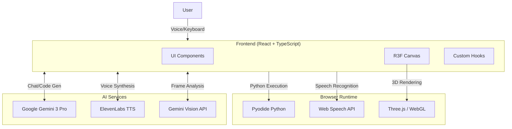

# 🧠 Neural Illumination

**Neural Illumination** is an immersive 3D learning platform that combines spatial computing, AI companionship, and interactive Python education. Built for the **Gemini 3 Hackathon**, it showcases the power of multimodal AI in creating next-generation educational experiences.


> *"Where code meets consciousness, and learning becomes an adventure."*

---

## 🚀 Key Features

### 🤖 Luna - AI Learning Companion
An autonomous AI avatar powered by **Google Gemini 3** that lives in the simulation:

- **Natural Conversation**: Voice-to-voice interaction using speech recognition and ElevenLabs TTS
- **Contextual Awareness**: Understands the simulation state and responds accordingly
- **Autonomous Behavior**: Wanders the environment, follows the user, and reacts to events
- **Leash System**: Intelligently stays within a 4-meter radius of the user
- **Real-time Animations**: Breathing, blinking, eye-tracking, and hand gestures

### 👁️ Mentor Mode (Computer Vision)
Activate Luna's vision capabilities for focused study sessions:

- **Webcam Analysis**: Captures and analyzes video frames every 30 seconds
- **Low-Light Enhancement**: Automatic brightness/contrast adjustment
- **Behavioral Detection**: Identifies phone usage, slouching, or lack of focus
- **Verbal Correction**: Luna speaks to correct bad habits ("Put the phone away!")
- **Rate Limiting**: Built-in pause/resume with exponential backoff

### 🔮 HoloProjector - Voice-Controlled 3D Graphics
Generate 3D holograms using voice commands:

- **Voice Commands**: "Show sphere", "Create blue torus", "Generate wireframe cube"
- **AI Code Generation**: Gemini 3 generates Python code that renders shapes
- **Supported Shapes**: Box, Sphere, Cylinder, Torus, Cone, Icosahedron, Knot, Heart
- **Customization**: Color, size, wireframe mode, and animation toggles
- **Real-time Rendering**: Shapes appear floating above the holographic projector

### 🐍 Python Learning System
An integrated coding environment with AI-powered tutoring:

- **In-Browser Runtime**: Python executed via Pyodide (WebAssembly)
- **Structured Curriculum**: 30+ challenges from beginner (Level 1) to advanced (Level 10)
- **AI Evaluation**: Gemini 3 evaluates submissions and provides personalized feedback
- **Error Analysis**: Luna explains errors and suggests fixes verbally
- **Gamification**: XP system, streaks, and progress tracking
- **Adaptive Difficulty**: Automatically adjusts based on performance

### 😊 Mood-Based Environment
AI-powered environment adaptation:

- **Facial Analysis**: Webcam captures analyzed by Gemini Vision
- **Mood Detection**: Identifies emotions (Happy, Focused, Stressed, etc.)
- **Auto-Environment**: Suggests and changes environment based on mood

### 🌍 5 Immersive Environments
Switch between beautifully crafted 3D environments:

| Environment | Theme | Best For |
|-------------|-------|----------|
| **Cyber** | Neon-lit futuristic hub | Intense focus, coding |
| **Nature** | Peaceful forest clearing | Relaxation, calm study |
| **Desert** | Warm canyon landscape | Contemplation, warm vibes |
| **Rainforest** | Lush tropical setting | Deep thinking, immersion |
| **Iceland** | Cool glacial serenity | Stress relief, clarity |

### 🎮 Interactive Controls
Full movement and interaction system:

- **WASD Movement**: Walk around the environment
- **Shift**: Sprint
- **Mouse**: Look around (when pointer locked)
- **Quality Settings**: Low, Medium, High graphics presets
- **Theme Toggle**: Cycle through all 5 environments

---

## 🏗️ System Architecture



### Data Flow

1. **Voice Input** → Speech Recognition → Text → Gemini 3 → Response → ElevenLabs → Audio
2. **Hologram Commands** → Gemini Code Generator → Python Code → Pyodide → Shape Data → R3F Render
3. **Mentor Mode** → Webcam Frame → Base64 → Gemini Vision → Behavioral Feedback → TTS
4. **Python Code** → Pyodide Runtime → Output/Error → AI Analysis → Verbal Feedback

---

## 📂 Project Structure

```text
simulation-control-room/
├── src/
│   ├── components/                 # React Three Fiber Components
│   │   ├── Avatar3D.tsx           # Luna avatar with physics & animation
│   │   ├── CyberRoom.tsx          # Cyberpunk environment
│   │   ├── NatureRoom.tsx         # Forest environment
│   │   ├── DesertRoom.tsx         # Desert canyon environment
│   │   ├── RainforestRoom.tsx     # Tropical rainforest environment
│   │   ├── IcelandRoom.tsx        # Glacial Iceland environment
│   │   ├── Experience.tsx         # Main scene composition
│   │   ├── HoloProjector.tsx      # 3D hologram display
│   │   ├── HoloScreen.tsx         # Holographic screen component
│   │   ├── PythonEditor.tsx       # Python IDE with Pyodide
│   │   ├── VoiceControls.tsx      # Voice interaction UI
│   │   ├── StageScreen.tsx        # Audio-reactive visualizer
│   │   ├── RealisticSky.tsx       # Dynamic sky system
│   │   ├── ServerRack.tsx         # Decorative server props
│   │   └── ErrorBoundary.tsx      # Error handling wrapper
│   │
│   ├── hooks/                      # Custom React Hooks
│   │   ├── useSimulation.ts       # Global simulation state
│   │   ├── useVoiceInteraction.ts # Voice chat with Luna
│   │   ├── useKeyboardControls.ts # WASD movement input
│   │   ├── usePerformanceSettings.ts # Graphics quality
│   │   └── useAudioAnalyzer.ts    # Audio visualization
│   │
│   ├── services/                   # External API Integrations
│   │   ├── gemini.ts              # Gemini 3 chat & actions
│   │   ├── codeGenerator.ts       # Hologram code generation
│   │   ├── pythonTutor.ts         # AI Python tutoring
│   │   ├── pythonAssistant.ts     # Code error analysis
│   │   ├── mentor.ts              # Computer vision mentor
│   │   ├── mood.ts                # Mood detection service
│   │   └── elevenlabs.ts          # Text-to-speech
│   │
│   ├── types/                      # TypeScript Definitions
│   │   ├── Character.ts           # Avatar & log types
│   │   └── LearningTypes.ts       # Challenge & evaluation types
│   │
│   ├── App.tsx                    # Main application entry
│   ├── main.tsx                   # React DOM root
│   └── index.css                  # Global styles
│
├── public/                         # Static assets
├── .env.example                   # Environment template
├── package.json                   # Dependencies
├── vite.config.ts                 # Vite configuration
└── tsconfig.json                  # TypeScript configuration
```

---

## 🛠️ Technology Stack

| Category | Technology | Purpose |
|----------|------------|---------|
| **Frontend** | React 19 + TypeScript | Core UI framework |
| **3D Engine** | Three.js + React Three Fiber | WebGL abstraction |
| **3D Helpers** | @react-three/drei | Text, Float, OrbitControls |
| **Post-Processing** | @react-three/postprocessing | Bloom, effects |
| **Build Tool** | Vite 7 | Fast dev server & bundler |
| **Styling** | Tailwind CSS v4 | Utility-first CSS |
| **AI Model** | Google Gemini 3 Pro Preview | Chat, vision, code gen |
| **Voice Synthesis** | ElevenLabs API | Neural TTS |
| **Speech Recognition** | Web Speech API | Browser-native STT |
| **Python Runtime** | Pyodide (WebAssembly) | In-browser Python 3.10 |
| **Code Editor** | react-simple-code-editor + Prism | Syntax highlighting |

---

## 📦 Installation & Setup

### Prerequisites

- **Node.js** 18+ (LTS recommended)
- **npm** or **yarn**
- **Google Gemini API Key** ([Get one here](https://aistudio.google.com/apikey))
- **ElevenLabs API Key** (Optional, for voice - [Get one here](https://elevenlabs.io/))

### 1. Clone the Repository

```bash
git clone https://github.com/your-username/neural-illumination.git
cd neural-illumination
```

### 2. Install Dependencies

```bash
npm install
```

### 3. Configure Environment Variables

Create a `.env` file in the project root:

```env
# Required: Google Gemini API Key
VITE_GEMINI_API_KEY=your_gemini_api_key_here

# Optional: ElevenLabs API Key (for Luna's voice)
VITE_ELEVENLABS_API_KEY=your_elevenlabs_api_key_here

# Optional: Custom ElevenLabs Voice ID (default: Rachel)
# VITE_ELEVENLABS_VOICE_ID=21m00Tcm4TlvDq8ikWAM
```

> ⚠️ **Important**: Never commit your `.env` file. It's already in `.gitignore`.

### 4. Start Development Server

```bash
npm run dev
```

Open [http://localhost:5173](http://localhost:5173) in your browser.

### 5. Build for Production

```bash
npm run build
```

The production build will be in the `dist/` directory.

---

## 🎮 How to Use

### Getting Started

1. **Open the App**: Navigate to `localhost:5173`
2. **Wait for Load**: The 3D environment loads automatically
3. **Allow Microphone**: When prompted, allow microphone access for voice features

### Voice Interaction

1. **Click the Microphone Button** near Luna
2. **Speak your message** ("Hello Luna", "Help me with Python")
3. **Wait for response** - Luna thinks, then speaks back

### Hologram Commands

Use voice commands to generate 3D shapes:

| Command | Result |
|---------|--------|
| "Show sphere" | Blue wireframe sphere |
| "Create red cube" | Red solid box |
| "Generate torus" | Cyan animated torus |
| "Show heart" | Heart-shaped hologram |

### Python Learning

1. **Toggle Learning Mode** in the Python editor
2. **Complete challenges** - Code is evaluated by AI
3. **Ask for help** - Click "Assistance" for Luna's explanation

### Mentor Mode

1. **Click "Mentor" button** in the HUD
2. **Allow camera access** when prompted
3. **Study normally** - Luna watches and provides feedback
4. **Get corrections** for phone usage, slouching, etc.

### Movement

- **W/A/S/D** - Move around
- **Shift** - Sprint
- **Mouse** - Look around (click to lock pointer)

### Settings

- **Theme Toggle** - Cycle environments (Cyber → Nature → Desert → Rainforest → Iceland)
- **Quality Toggle** - Switch between Low, Medium, High graphics

---

## 🔧 Development Guide

### Code Style

- **ESLint** configured for React/TypeScript
- Run linting: `npm run lint`

### Adding a New Environment

1. Create `src/components/YourRoom.tsx`
2. Export a React component with floor, lighting, and decorations
3. Add to the environment union type in `App.tsx`
4. Add switch case in `Experience.tsx`

### Adding a New AI Service

1. Create `src/services/yourService.ts`
2. Initialize `GoogleGenerativeAI` with the API key
3. Create async functions with error handling
4. Export and use in components

### Creating New Hologram Shapes

1. Edit `src/services/codeGenerator.ts`
2. Update the `SHAPE MAPPINGS` in the system prompt
3. Add geometry handling in `HoloProjector.tsx`

---

## 🤝 Contributing

Contributions are welcome! Please follow these steps:

1. **Fork** the repository
2. **Create a branch**: `git checkout -b feature/amazing-feature`
3. **Commit changes**: `git commit -m 'Add amazing feature'`
4. **Push**: `git push origin feature/amazing-feature`
5. **Open a Pull Request**

### Guidelines

- Write clean, documented code
- Follow existing patterns and naming conventions
- Test thoroughly before submitting
- Update README if adding new features

---

## 🐛 Troubleshooting

### Common Issues

| Issue | Solution |
|-------|----------|
| "Missing GEMINI_API_KEY" warning | Add `VITE_GEMINI_API_KEY` to `.env` |
| Voice not working | Check microphone permissions in browser |
| No Luna voice | Add `VITE_ELEVENLABS_API_KEY` or use browser TTS fallback |
| Python editor not loading | Wait for Pyodide to download (~10MB first load) |
| Rate limit errors (429) | Wait 2 minutes, Mentor Mode auto-pauses |
| Black screen | Check browser WebGL support, try lowering quality |

### Browser Support

- **Chrome** (Recommended) - Full support
- **Edge** - Full support
- **Firefox** - May have WebGL issues
- **Safari** - Limited voice support

---

## 📄 License

This project is licensed under the **MIT License**. See [LICENSE](LICENSE) for details.

---

## 🙏 Acknowledgments

- **Google Gemini Team** - For the powerful Gemini 3 API
- **ElevenLabs** - For natural voice synthesis
- **React Three Fiber** - For making Three.js declarative
- **Pyodide Team** - For Python in the browser

---

## 📬 Contact

- **Project**: Neural Illumination
- **Hackathon**: Gemini 3 Hackathon 2026
- **Author**: Md Shakhawat Hossain

---

*Built with ❤️ and AI for the future of education.*
